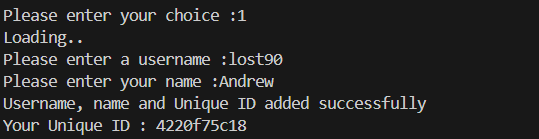

# Neo Data Manager (v1.1) 🗃️ : Data Persistence & QR Engine

[](https://www.python.org/)
[](https://opensource.org/licenses/MIT)

A high-performance CLI tool developed to handle structured data management through Object-Oriented Programming. This system bridges the gap between local JSON storage and physical data representation via QR codes.

---

## 🚀 Technical Highlights
- **Persistent Storage**: Custom JSON serialization logic for reliable data recovery and reuse.
- **Cryptographic IDs**: Integration of the `uuid` module to generate unique 10-character Hexadecimal identifiers.
- **Automated QR Generation**: Dynamic QR code creation for every entry with an automated OS-level cleanup routine to maintain system hygiene.
- **Resilient UI**: Multi-layered input validation and confirmation loops to prevent data corruption.

## ✨ Core Features
- **Record Management**: Add, search, and delete records seamlessly via an interactive CLI.
- **Timestamps**: Each record includes a "Last saved" time for accurate tracking.
- **Educational Journey**: Built as part of my learning journey as a first-year undergraduate student, focusing on iterative improvement.

## 📸 Gallery
<details>
  <summary>Click to see the Manager in action!</summary>
  
  ### Main Menu
  
  
  ### Adding Records (UUID Generation)
  
  
  ### Searching & QR Export
  
</details>

---

## 🛠️ Installation & Setup

1. **Clone the Repo**

```bash
   git clone [https://github.com/Neo-Aizen07/neo-data-manager.git](https://github.com/Neo-Aizen07/neo-data-manager.git)
   cd neo-data-manager
   ```
2. **Install Dependencies**

 ```bash
 pip install -r requirements.txt
 ```

3. **Run the engine**
```bash
python main.py
📈 Version History
v1.0: Initial release with basic CRUD operations.
```bash
v1.1 (Current): Fixed logic errors, improved JSON serialization, and optimized UUID generation.
```
